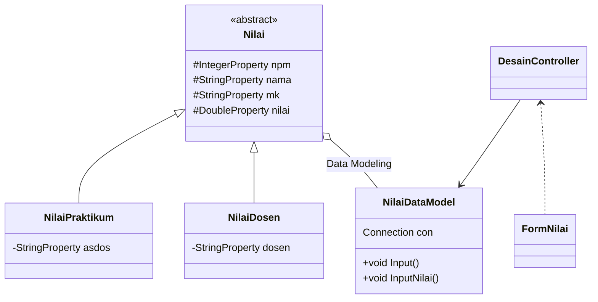

# Tugas-Akhir-PBO
# MOHAMMAD FAJAR 1917051014 - MEMBUAT ER DIAGRAM & CLASS DATA MODEL
# FIKRI ASLAM TAUFIQURRAHMAN 1917051025 - MEMBUAT PROGRAM
# TEGAR JAYANAGA 1917051071 - MEMBUAT CLASS DIAGRAM & CLASS CONTROLLER

### Class Diagram

### ER Diagram

            
