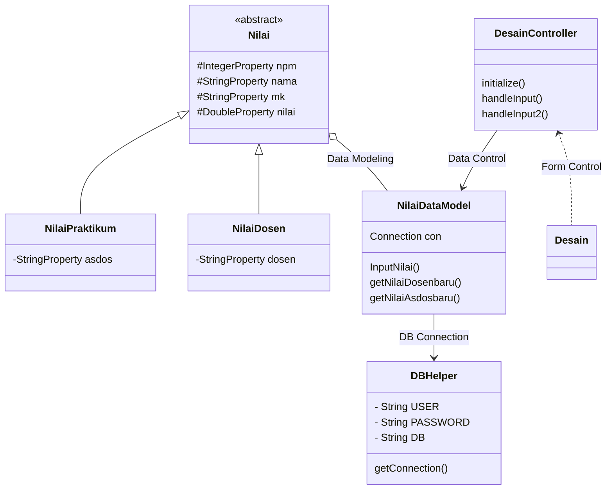

# Tugas Akhir PBO
# Sistem Input Nilai Mahasiswa
> Sistem dapat digunakan untuk perekaman data nilai mahasiswa, dimana terdapat 2 jenis nilai yaitu nilai dari dosen dan nilai praktikum.

MOHAMMAD FAJAR 1917051014 - MEMBUAT ER DIAGRAM & CLASS DATA MODEL
FIKRI ASLAM TAUFIQURRAHMAN 1917051025 - MEMBUAT PROGRAM
TEGAR JAYANAGA 1917051071 - MEMBUAT CLASS DIAGRAM & CLASS CONTROLLER

### Design Class Diagram for JavaFX and Database

### ER Diagram

            
