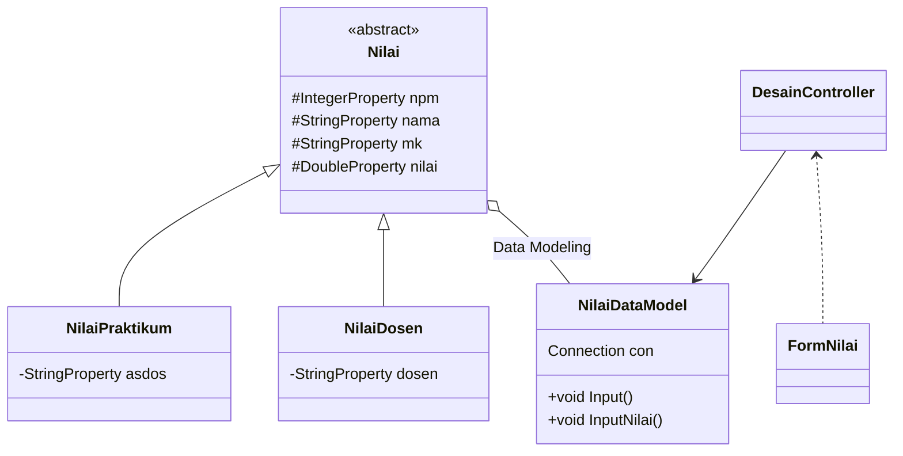

# Tugas-Akhir-PBO
### Class Diagram

```mermaid
classDiagram
    Nilai <|-- NilaiPraktikum
    Nilai <|-- NilaiDosen
    Nilai o-- NilaiDataModel : Data Modeling
    DesainController --> NilaiDataModel
    DesainController <.. FormNilai

    class Nilai{
        <<abstract>>
        #IntegerProperty npm
        #StringProperty nama
        #StringProperty mk
        #DoubleProperty nilai
    }
    class NilaiPraktikum{
      -StringProperty asdos
    }
    class NilaiDosen{
      -StringProperty dosen
    }
    class NilaiDataModel{
        Connection con
        +void Input()
        +void InputNilai()
    }
    class DesainController{
    
    }
```
            
