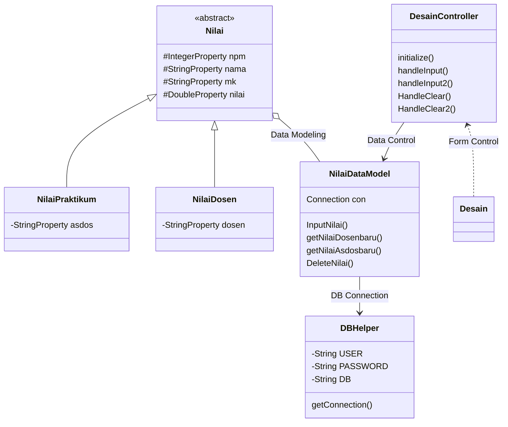
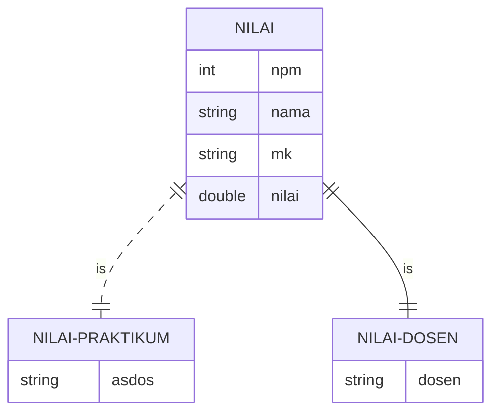

# Tugas Akhir Pemrograman Berorientasi Objek : Sistem Input Nilai Mahasiswa
> Pada penugasan final project ini kelompok kami membuat sebuah program tentang Sistem Input Nilai Mahasiswa
> Sistem dapat digunakan untuk perekaman data nilai mahasiswa, dimana terdapat 2 jenis nilai yaitu nilai dari dosen dan nilai praktikum.
> User dapat menginput data nilai mahasiswa dengan mengisi form lalu klik tombol input.
> User juga dapat menghapus data nilai mahasiswa dengan memasukkan NPM, data yang ingin dihapus tinggal klik tombol hapus data.

- MOHAMMAD FAJAR 1917051014 - MEMBUAT ER DIAGRAM & CLASS DATA MODEL
- FIKRI ASLAM TAUFIQURRAHMAN 1917051025 - MEMBUAT PROGRAM
- TEGAR JAYANAGA 1917051071 - MEMBUAT CLASS DIAGRAM & CLASS CONTROLLER

### Design Class Diagram for JavaFX and Database

### ER Diagram

            
